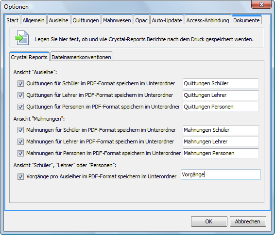

# Archivieren

## Berichte archivieren


Magellan 6-Bibliothek unterstützt Sie bei der Archivierung Ihrer Dokumente. Sie haben die Möglichkeit verschiedene Berichte, die Sie im Zusammenhang mit dem Leihbetrieb und dem Mahnwesen erstellen, standardmäßig in elektronischer Form zu speichern. Wenn Sie diese Funktion aktivieren wird von Ihren gedruckten Berichten automatisch ein Duplikat als PDF-Dokument erstellt und in einem von Ihnen bestimmten Verzeichnis abgelegt.


Auf diese Weise erübrigt sich das Führen eines Papierarchivs für einen wesentlichen Teil der in Ihrer Bibliothek anfallenden Dokumente.
Diese Funktion des elektronischen Archivierens steht für folgende Berichtsarten zur Verfügung:


* Quittungen
* Mahnungen
* Leihvorgänge pro Ausleiher


Diese Berichtsarten werden jeweils pro Ausleiher in der Magellan-Dokumentenverwaltung archiviert. Die Magellan-Dokumentenverwaltung befindet sich standardmäßig unter folgenden Pfaden:


Betriebssystem|Pfad
--|--
Windows Vista| C:\Users\Public\Documents\Stueber Systems\Magellan 6\Dokumente```
Windows XP |C:\Dokumente und Einstellungen\All Users\Anwendungsdaten\Stueber Systems\Magellan 6\Dokumente


Die Dokumente werden getrennt nach Schüler, Lehrer und Personen verwaltet. Für jede Ausleihergruppe wird in der der Magellan-Dokumentenverwaltung jeweils ein eigenes Unterverzeichnis angelegt.


## Quittungen archivieren


Um Ihre Leihvorgangsquittungen elektronisch zu archivieren, gehen Sie bitte folgendermaßen vor:


1. Führen Sie den Menüpunkt „Extras|Optionen“ aus und öffnen Sie die Registerkarte „Dokumente“.
2. Lassen Sie den Reiter „Crystal Reports“ aktiviert.
3. Setzen Sie den Haken in den drei Kontrollkästchen vor „Quittungen für … (Schüler/Lehrer/Personen) im PDF-Format speichern im Unterordner“.
4. Tragen Sie den Namen des gewünschten Zielverzeichnisses in die drei Eingabefelder neben „Quittungen für … (Schüler/Lehrer/Personen) im PDF-Format speichern im Unterordner“.
5. Bestätigen Sie Ihre Angaben abschließend mit „OK“.


In der Magellan Dokumentenverwaltung passiert dabei Folgendes:


Sobald Sie eine Leihvorgangsquittung drucken, wird für den Ausleiher im zugehörigen Unterverzeichnis der Ausleihergruppe ein Unterverzeichnis mit seiner ID angelegt. In diesem Unterverzeichnis wird wiederum ein Ordner angelegt, der den gewünschten Namen des Quittungsordners trägt. Alle ausgedruckten Leihvorgangsquittungen dieses Ausleihers werden von nun ab als PDF-Duplikat in diesem Ordner gespeichert.


## Mahnungen archivieren


Um Ihre Mahnungen elektronisch zu archivieren, gehen Sie bitte folgendermaßen vor:
1. Führen Sie den Menüpunkt „Extras|Optionen“ aus und öffnen Sie die Registerkarte „Dokumente“.
2. Lassen Sie den Reiter „Crystal Reports“ aktiviert.
3. Setzen Sie den Haken in den drei Kontrollkästchen vor „Mahnungen für … (Schüler/Lehrer/Personen) im PDF-Format speichern im Unterordner“.
4. Tragen Sie den Namen des gewünschten Zielverzeichnisses in die drei Eingabefelder neben „Mahnungen für … (Schüler/Lehrer/Personen) im PDF-Format speichern im Unterordner“.
5. Bestätigen Sie Ihre Angaben abschließend mit „OK“.
In der Magellan Dokumentenverwaltung passiert dabei Folgendes:
Sobald Sie eine Mahnung drucken, wird für den Ausleiher im zugehörigen Unterverzeichnis der Ausleihergruppe ein weiteres Unterverzeichnis mit seiner ID angelegt. In diesem Unterverzeichnis wird wiederum ein Ordner angelegt, der den gewünschten Namen des Mahnungsordners trägt. Alle ausgedruckten Mahnungen dieses Ausleihers werden von nun ab als PDF-Duplikat in diesem Ordner gespeichert.


## Leihvorgänge pro Ausleiher archivieren


Wenn Sie in der Ansicht Vorgänge den Bericht „Medienvorgänge (Standard)“ ausdrucken, können Sie diesen Bericht bei allen markierten Ausleihern ebenfalls elektronisch archivieren lassen. Gehen Sie dazu bitte folgendermaßen vor:


1. Führen Sie den Menüpunkt „Extras|Optionen“ aus und öffnen Sie die Registerkarte „Dokumente“.
2. Lassen Sie den Reiter „Crystal Reports“ aktiviert.
3. Setzen Sie den Haken im Kontrollkästchen vor „Vorgänge pro Ausleiher im PDF-Format speichern im Unterordner“.
4. Tragen Sie den Namen des gewünschten Zielverzeichnisses in das Eingabefeld neben „Vorgänge pro Ausleiher im PDF-Format speichern im Unterordner“.
5. Bestätigen Sie Ihre Angaben abschließend mit „OK“.


In der Magellan Dokumentenverwaltung passiert dabei Folgendes:


Sobald Sie den Bericht „Medienvorgänge (Standard)“ drucken, werden für alle markierten Ausleiher Unterverzeichnisse mit ihrer ID angelegt. In diesen Unterverzeichnissen wird wiederum ein Ordner angelegt, der den gewünschten Namen des Vorgangsordners trägt. Alle ausgedruckten Berichte „Medienvorgänge (Standard)“, welche Leihvorgänge dieser Ausleiher enthalten, werden in der Folge in diesem Ordner gespeichert.





 
