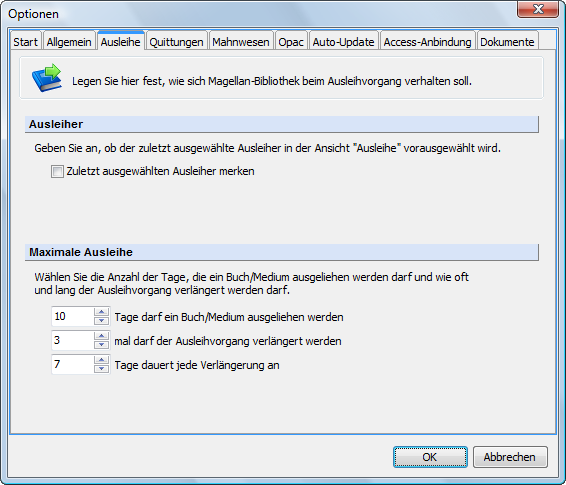

# Mahnungen erstellen

Für die Organisation und Abwicklung Ihres Mahnwesens steht Ihnen die Ansicht „Mahnungen“ zur Verfügung. Wenn Sie diese Ansicht aufrufen, sehen Sie unter der Registerkarte „Überzogene Bücher/ Medien“ ein Tabellenblatt mit einer Liste aller überzogenen Leihvorgänge. Diese enthält Spalten für die Ausleiher- und Exemplardaten sowie folgende spezifisch für das Mahnwesen relevante Spalten:
* Die Spalte „Ausleihe bis“ zeigt das Datum, an dem die Leihfrist abgelaufen ist.
* Die Spalte „Überfällig“ zeigt die Anzahl der Tage seit dem Ende der Leihfrist.
* Die Spalte „Mahnstufe“ zeigt, ob ein Mahnverfahren eingeleitet wurde sowie ggf. die Anzahl der bereits ausgestellten Mahnungen.
* Die Spalte „Zuletzt gemahnt am“ zeigt das Datum, an dem die letzte Mahnung ausgestellt wurde.
* Die Spalte „Nächste Mahnstufe“ zeigt die Anzahl der Tage bis /seit dem Fälligkeitsdatum der nächsten Mahnstufe.
Auf der Basis dieser Informationen entscheiden Sie, ob Sie für die aufgelisteten Leihvorgänge ein Mahnverfahren einleiten bzw. die nächste Mahnstufe zuweisen. Die Einleitung eines Mahnverfahrens bzw. der nächsten Stufe dieses Verfahrens beinhaltet die folgenden beide Teilschritte:
* Mahnstufe zuweisen
* Mahnung ausdrucken

## Mahnstufe zuweisen 

Das Mahnverfahren in Magellan-Bibliothek umfasst drei Mahnstufen. Sie leiten das Mahnverfahren ein, indem Sie die erste Mahnstufe zuweisen. Damit Sie eine Mahnstufe zuweisen können, muss im Vorfeld definiert sein, welcher Abstand zwischen dem Leihfristende und der 1. Mahnstufe bzw. zwischen den einzelnen Mahnstufen liegen soll. In Magellan-Bibliothek ist für diese Abstände von Haus aus ein Wert von 10 Tagen hinterlegt.

Um diese Abstände zu ändern, gehen Sie bitte folgendermaßen vor:

1. Rufen Sie den Menüpunkt „Extras|Optionen“ auf und öffnen Sie die Registerkarte „Mahnwesen“.
2. Tragen Sie im Feld „Tage bis die erste Mahnstufe gesetzt werden kann“ die Anzahl der Tage ein, die zwischen dem Leihfristende und der ersten Mahnstufe liegen soll.
3. Tragen Sie in den Feldern vor „Tage bis die zweite Mahnstufe gesetzt werden kann“ bzw. „Tage bis die dritte Mahnstufe gesetzt werden kann“ die Anzahl der Tage ein, die zwischen den Mahnstufen liegen soll.
4. Bestätigen Sie Ihre Angaben abschließend mit „OK“.
Die geänderten Einstellungen sind nun gespeichert und werden beim nächsten Aufruf der Ansicht „Mahnungen“ wirksam.

Um nun eine Mahnstufe zuzuweisen, führen Sie bitte die folgenden Schritte aus:
1. Markieren Sie in der Liste der überzogenen Medien die Vorgangszeile eines Exemplars, welches das Fälligkeitsdatum für die nächste Mahnstufe erreicht hat.
2. Klicken Sie in der Symbolleiste des Programmfensters auf die Schaltfläche „Nächste Mahnstufe“
3. Tragen Sie im erscheinenden Dialogfenster das Mahndatum ein: dieses Datum wird in der Spalte „Zuletzt gemahnt am…“ hinterlegt.
4. Bestätigen Sie das eingegebene Mahndatum mit „OK“: es erscheint ein Vorschaufenster der erstellten Mahnung.
5. Betätigen Sie die Schaltfläche „Drucken“ in der Symbolleiste des Vorschaufensters, um den Mahnungsausdruck durchzuführen.

Oder:

Schließen Sie das Vorschaufenster, um den Ausdruck der Mahnung auf später zu verschieben.
In der Spalte „Mahnstufe“ des Tabellenblatts „Überzogene Bücher/ Medien“ wird das Verfahren für diesen Vorgang auf die nächste Stufe hochgesetzt.
Sie können die Zuweisung einer Mahnstufe wieder rückgängig machen, indem Sie die Schaltfläche „Mahnstufe Rückgängig“ in der Symbolleiste des Programmfensters betätigen. Dadurch wird in der Spalte „Mahnstufe“ der Tabelle „Überzogene Bücher/ Medien“ das Mahnverfahren für diesen Vorgang um eine Stufe herabgesetzt.

## Mahnung ausdrucken

Im vorherigen Abschnitt haben Sie bereits erfahren, wie Sie eine Mahnung im Verlauf der Zuweisung einer Mahnstufe ausdrucken können. Damit Sie diese Funktion nutzen können, muss im Vorfeld eine Berichtsdatei definiert sein, die als Mahnungsvorlage dient. Um diese Berichtsdatei festzulegen, gehen Sie bitte folgendermaßen vor:

1. Führen Sie den Menüpunkt „Extras|Optionen“ aus und öffnen Sie im erscheinenden Dialogfenster die Registerkarte „Mahnwesen“
2. Betätigen Sie im Auswahlfeld „Mahnungenbericht“ die Schaltfläche mit den Pünktchen
3. Stellen Sie im Auswahlfeld „Suchen in“ des erscheinenden Dialogfensters das Verzeichnis „Mahnungen“ ein
4. Markieren Sie im ausgewählten Verzeichnis die Datei „Mahnungen.rpt“
5. Bestätigen Sie Ihre Auswahl mit „Öffnen“: der Dateipfad der Berichtsdatei wird im Feld „Mahnungenbericht“ hinterlegt
6. Bestätigen Sie abschließend mit „OK“

Die ausgewählte Berichtsdatei wird nun als Vorlage für den Mahnungsausdruck hinterlegt.

>Die Berichtsdatei „Mahnungen.rpt“ wird bei der Installation im Programmverzeichnis von Magellan-Bibliothek abgelegt und kann von Ihnen als Formatvorlage für das Erstellen von Mahnungen genutzt werden. Wenn Sie darüber hinaus weitere Formatvorlagen benötigen, so könne Sie diese mit dem von Magellan unterstützen Berichtsgenerator „Crystal Reports“ erstellen.

Den Ausdruck eines Mahnungsbericht können Sie auch durchführen, nachdem Sie eine Mahnstufe bereits zugewiesen haben. Dieses Vorgehen hat den Vorteil, dass Sie mehrere Mahnungsberichte gleichzeitig drucken können.

Um Mahnungsberichte nachträglich auszudrucken, gehen Sie bitte folgendermaßen vor:

1. Markieren Sie die gewünschten Einträge in der Liste „Überzogene Bücher/ Medien.
2. Führen Sie den Menüpunkt „Bearbeiten|Drucken“ aus und markieren Sie im erscheinenden Dialogfenster eine Berichtsdatei, z.B. „Mahnungen.rpt“.
3. Betätigen Sie die Schaltfläche „Drucken“ in der Symbolleiste des Dialogfensters.
4. Bestätigen Sie die Einstellungen im erscheinenden Dialogfenster „Drucken“ mit „OK“.
Der Ausdruck der Mahnungen für die ausgewählten Leihvorgänge wird gestartet .

#### Aufgabe 18
Leiten Sie bitte das Mahnverfahren für den überzogenen „Diercke Weltatlas“ des Ausleihers „Helmut Thull“ ein. Drucken Sie den Mahnbericht über das Vorschaufenster aus.
