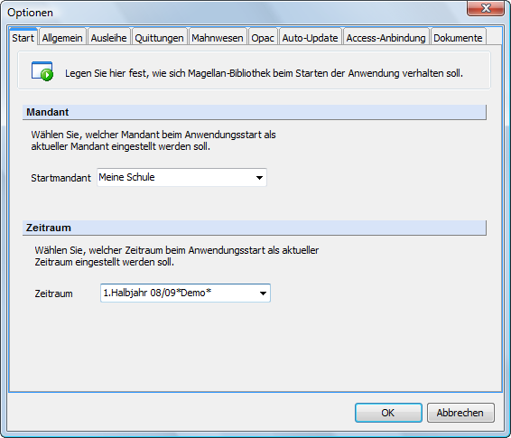

# Mit mehreren Mandanten arbeiten

Magellan-Bibliothek ist wie das Basismodul mandantenfähig. Dies bedeutet, dass Sie die Bibliotheksdaten unterschiedlicher organisatorischer Gliederungen in einer Datenbank verwalten können. Dieses Datenbankkonzept erfordert, dass mindestens ein Mandant angelegt ist, da alle Daten in Magellan bezogen auf bestimmte Mandanten gespeichert werden.

> #### primary::Hinweis
>
>  Mandanten können nur im Basismodul angelegt werden. Wie Sie dabei vorgehen, entnehmen Sie bitte dem Kapitel „Datenbank vorbereiten“ im Magellan 6-Benutzerhandbuch.

Die meisten Anwender von Magellan 6 und Magellan 6-Bibliothek arbeiten mit nur einem Mandanten. In diesem Fall müssen Sie im Bibliotheksmodul keine weiteren Einstellungen vornehmen. Der im Basismodul angelegte Mandant wird beim Programmstart automatisch als aktueller Mandant voreingestellt. Der Name des aktivierten Mandanten wird auf der Schaltfläche „Aktueller Mandant“ in der Symbolleiste des Programmfensters angezeigt.

Wenn Sie allerdings mit mehreren Mandanten arbeiten, müssen Sie im Vorfeld den Mandanten auswählen, dessen Daten Sie bearbeiten wollen.

Gehen Sie dazu bitte folgendermaßen vor:

1. Betätigen Sie die Schaltfläche „Aktueller Mandant“ in der Symbolleiste des Programmfensters.
2. Markieren Sie im Aufklappmenü den gewünschten Mandanten und bestätigen Sie Ihre Auswahl mit „OK“.

Der Name des ausgewählten Mandanten erscheint auf der Schaltfläche „Aktueller Mandant“. Die Daten, die für diesen Mandanten gespeichert wurden, sind nun in den einzelnen Ansichten verfügbar.
Sie können darüberhinaus im Vorfeld festlegen, welcher Mandant beim Start von Magellan-Bibliothek aktiv gesetzt sein soll.

Um diese Einstellung vorzunehmen, gehen Sie bitte folgendermaßen vor:

1. Führen Sie den Menüpunkt „Extras|Optionen“ aus und bleiben Sie auf der Registerkarte „Start“.
2. Betätigen Sie die Pfeilschaltflläche des Auswahlfeldes „Startmandant“ und markieren Sie im Aufklappmenü den gewünschten Eintrag.
3. Bestätigen Sie Ihre Angaben abschließend mit „OK“.
Der gewählte Mandant wird nun beim nächsten Programmstart automatisch als aktueller Mandant voreingestellt.

Die Liste der in Magellan angelegten Mandanten können Sie in der Ansicht „Mandanten“ auf der Re-gisterkarte „Auswahl“ einsehen. Auf der Registerkarte „Daten“ ist für jeden Mandanten eine Kartei-karte mit den wesentlichen Kontaktinformationen hinterlegt.
